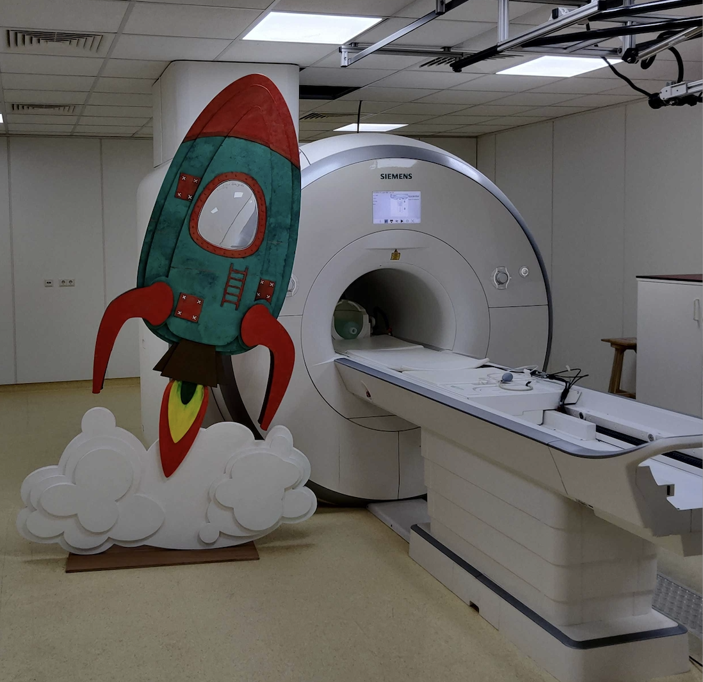

<center>
## MRI (‘Magnetic Resonance Imaging’) 
</center>
```{r setup, include=FALSE}
knitr::opts_chunk$set(echo = TRUE)
```


In de CODEC gedragsstudie kijken we hoe uw kind op verschillende momenten en verschillende dagen cognitieve taakjes uitvoert. Naast deze waardevolle inzichten willen we ook erg graag kijken hoe uw kind zulke puzzels oplost, door een kijkje te nemen in de hersenen, en te kijken naar de activiteit en structuur van de hersenen tijdens de ontwikkeling van uw kind. 

Bij de locatie van het onderzoek, het Donders instituut, hebben we speciale hersenscanners waarmee we in de hersenen kunnen kijken terwijl kinderen puzzels oplossen. Dit doen we door gebruik te maken van ‘MRI’, wat staat voor ‘Magnetic Resonance Imaging’.
MRI wordt beschouwd als een onderzoeksmethode met een verwaarloosbaar risico en minimale last voor uw kind. De MRI maakt beelden van de hersenen, en biedt ons de unieke mogelijkheid om te bestuderen hoe de hersenen actief zijn terwijl uw kind bepaalde taken doet. Zo krijgen we als het ware een compleet plaatje van de hersenen, en wat er in de hersenen gebeurt. 


[{width=30% align="right"}](meedoen.html)

<div style="left: 0; width: 100%; height: 0; position: relative; padding-bottom: 56.25%;"><iframe src="https://www.youtube.com/embed/M7mbykvrr3I" style="top: 0; left: 0; width: 100%; height: 100%; position: absolute; border: 0;" allowfullscreen scrolling="no" allow="accelerometer; clipboard-write; encrypted-media; gyroscope; picture-in-picture; web-share;"></iframe></div>

---

<center>
## De dag zelf
</center>
<b> Op de dag zelf </b> krijgt uw kind eerst een introductie. Hierbij leggen we uw kind uit wat we precies gaan doen. Uw kind zal beginnen met het doen van de cognitieve taakjes, die het geheugen en de snelheid van verwerking van informatie testen. Deze taakjes heeft uw kind al eerder in de klas gedaan. Daarna zal uw kind wat korte vragenlijstjes invullen. Uw kind krijgt na de uitleg de mogelijkheid om plaats te nemen in onze oefenscanner. In deze oefenscanner (zonder magneetveld) kan uw kind vast ervaren hoe het is om in een echte scanner te liggen. Hierna zal uw kind gescand worden in het echte MRI-apparaat, als een ware astronaut. 
<i><b>
Als dank voor de deelname krijgt u voor u en uw kind een toegangskaartje voor Burger’s Zoo (twee kaartjes) of Dierenpark Amersfoort! </i></b>


```{r, out.width = "60%", fig.align = 'center', echo=FALSE}



```


--- 

<center>
## Het doel
</center>
In de leeftijdsfase waarin uw kind nu zit verandert er veel: kinderen leren van alles en maken vaak grote sprongen. Wij willen graag beter begrijpen hoe de ontwikkeling van de hersenen hier een rol bij speelt. Daarom willen we uw kind graag twee keer meten in de hersenscanner: <b>dit jaar</b>, en over ongeveer <b>drie jaar</b>.

Tijdens deze sessies doen u en uw kind enkele computertaken en vullen jullie een aantal vragenlijsten in. Twee computertaken zullen door uw kind in een fMRI scanner worden uitgevoerd, zodat we kunnen meten wat er in de hersenen van uw kind gebeurt. Een MRI scanner is een soort grote buis waar iemand met het hoofd in kan liggen. In deze scanner kunnen we een zogeheten ‘fMRI’ scan maken. Dat staat voor ‘Functional Magnetic Resonance Imaging'. Met behulp van magneetvelden kunnen we bekijken welke delen van de hersenen actief zijn in bepaalde situaties. Tijdens de scan worden er heel snel achter elkaar plaatjes van de hersenen gemaakt. Zo kunnen we zien welke delen van de hersenen het meest actief zijn tijdens het uitvoeren.


<b> Meer uitleg over een MRI sessie bij het Donders Instituut: </b>

<div style="left: 0; width: 100%; height: 0; position: relative; padding-bottom: 56.25%;"><iframe src="https://www.youtube.com/embed/wia_0w5qUuA" style="top: 0; left: 0; width: 100%; height: 100%; position: absolute; border: 0;" allowfullscreen scrolling="no" allow="accelerometer; clipboard-write; encrypted-media; gyroscope; picture-in-picture; web-share;"></iframe></div>
