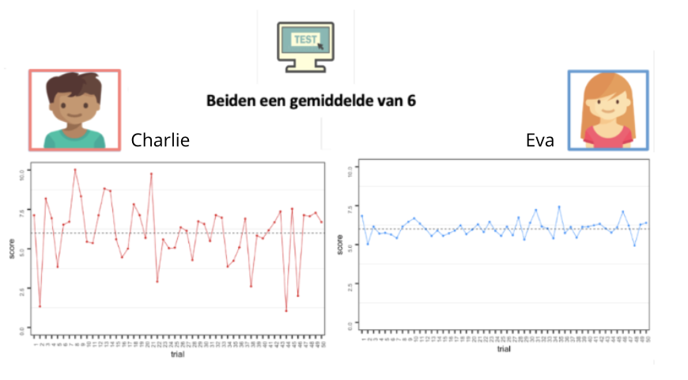

---
title: "Cognitieve fluctuatie"
description: |
favicons: ["images/favicon.ico"]
--- 
<center>
## Wat is Cognitieve Fluctuatie?
</center>

We weten dat kinderen snel ontwikkelen wat betreft hun cognitieve vaardigheden, en deze vaardigheden worden op school vaak gemeten. 

Wat we echter minder vaak meten is zogeheten <i> fluctuatie </i> , of variabiliteit – verschillen in geheugen of snelheid van het ene moment op het andere, tussen momenten in de dag, of tussen dagen. In deze studie hopen we <strong> beter </strong>  te begrijpen hoe die fluctuatie plaatsvindt, of sommige kinderen deze fluctuatie meer of minder laten zien, en hoe die fluctuatie samenhangt met allerlei zaken: slaap, creativiteit, gemoedstoestand en meer.

Onderzoek naar cognitieve verschillen focust zich meestal op gemiddelde prestaties, zoals gemiddelde scores, waarbij de inherente schommelingen in cognitieve prestaties van individuen soms buiten beschouwing werden gelaten (zie Charlie en Eva). Deze schommelingen werden vaak afgedaan als ruis of meetfouten. Recent onderzoek geeft nu echter aan dat cognitieve variabiliteit een fundamenteel gedragskenmerk is met implicaties voor leren, veroudering en neurologische ontwikkelingsstoornissen.

```{r, out.width = "80%", fig.align = 'center', echo=FALSE}



```


<i>
Charles en Ada scoren beiden een gemiddelde van 6, maar scoren over de dagen heen erg verschillend. Charles laat veel meer fluctuatie zien in zijn scores vergeleken met Ada. Toch hebben beide kinderen hetzelfde gemiddelde. Dit gemiddelde is dus eigenlijk geen goede representatie van de daadwerkelijk behaalde resultaten.
</i>

In tegenstelling tot computers fluctueert onze uitvoering van cognitieve taken bij elke herhaling. 
<strong> Soms kan fluctuatie een goede zaak zijn </strong>: fluctuate kan reflecteren dat we de ruimte van mogelijke oplossingen voor een probleem verkennen. <strong> Op andere momenten weerspiegelt fluctuatie mogelijke gebreken </strong>een gebrek aan focus, gemakkelijk afgeleid worden of na verloop van tijd verveeld raken.

Fluctuatie in je prestaties kan te zien zijn tussen verschillende dagen, Tussen sessies (ochtend, middag), tussen de verschillende meetmomenten en tijdens eenzelfde meetmoment.

De mate waarin kinderen schommelen in hun cognitieve prestaties is het centrale onderzoeksgebied in het <strong> CODEC project </strong>. Met behulp van technologische innovaties zoals op tablets gebaseerde taken en nieuwe kwantitatieve modelleringstechnieken hopen we de oorzaken en gevolgen van de ups en downs in de cognitieve prestaties van de kinderen beter te begrijpen. Door de structuur van cognitieve variabiliteit te onderzoeken, heeft dit onderzoek het potentieel om waardevolle inzichten te bieden met implicaties voor onderwijs en interventies bij neuro-ontwikkelingsstoornissen.

[Eerder onderzoek van ons Lab](onderzoek.html) 


<div style="left: 0; width: 100%; height: 0; position: relative; padding-bottom: 56.25%;"><iframe src="https://www.youtube.com/embed/N0WvedtupvU" style="top: 0; left: 0; width: 100%; height: 100%; position: absolute; border: 0;" allowfullscreen scrolling="no" allow="accelerometer; clipboard-write; encrypted-media; gyroscope; picture-in-picture; web-share;"></iframe></div>


```{r setup, include=FALSE}
knitr::opts_chunk$set(echo = FALSE)
```
