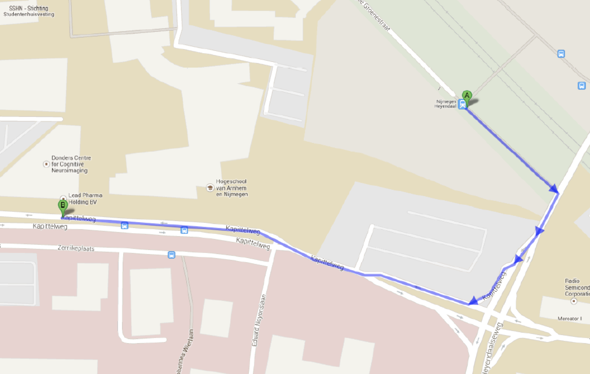

## Contact
U kunt contact opnemen met ons [team](team.html) via het e-mail adres: <b>codecstudies.cns@radboudumc.nl</b>

We kunnen ons natuurlijk voorstellen dat u vragen heeft over de studie, daarom hebben wij de meest voorkomende vragen voor u op een rijtje gezet. [Hier](vragen.html) vindt u de antwoorden op de <b>[veelgestelde vragen](vragen.html)</b>


## Route  

Het MRI deel van de studie bevindt zich bij het Donders Instituut in het Trigon gebouw in Nijmegen. 
Adres: Kapittelweg 29, 6525 EN Nijmegen

<strong> Met het openbaar vervoer </strong>
U kunt vanaf Nijmegen Centraal de bus/trein nemen naar station Nijmegen Heyendaal. Vanaf station Nijmegen Heyendaal is het ongeveer 10 minuten lopen naar Trigon. De route is hieronder weergeven. Alle reiskosten naar het Donders Instituut zullen vergoed worden.

```{r, out.width = "100%", fig.align = 'center', echo=FALSE}



```

<strong> Met de auto </strong>
U kunt parkeren voor de hoofdingang van het Trigon op een van de parkeerplaatsen. Deze parkeerplaatsen zijn te bereiken via de ingang tussen het HAN gebouw en het Trigon gebouw. De parkeerplaats is afgesloten met een slagboom, die geopend wordt door een medewerker. Indien de parkeerplaats vol is, kunt u parkeren op “Laan van Scheut” / “Rode Kruislaan”, straten achter het Trigon gebouw. Hier kunt u (betaald) parkeren, als u betaalt via de parkeerautomaat of de Parkmobile app, en uw bewijsje van betaling bewaart dan kunt u de gemaakte parkeerkosten bij ons declareren

<strong> Met de fiets </strong>
Het Donders Instituut is bereikbaar op de fiets. Er is een (buiten) fietsenstalling voor het gebouw. 

<b> Bij binnenkomst </b> U kunt bij binnenkomst plaatsnemen in de wachtkamer, waar u en uw kind zullen worden opgehaald. De wachtkamer bevindt zich direct naast de ingang, aan de linkerkant. Het onderstaande filmpje laat u zien waar u de wachtkamer kan vinden. 

<div style="left: 0; width: 100%; height: 0; position: relative; padding-bottom: 56.25%;"><iframe src="https://www.youtube.com/embed/4PtZaJI8r3A" style="top: 0; left: 0; width: 100%; height: 100%; position: absolute; border: 0;" allowfullscreen scrolling="no" allow="accelerometer; clipboard-write; encrypted-media; gyroscope; picture-in-picture; web-share;"></iframe></div>

