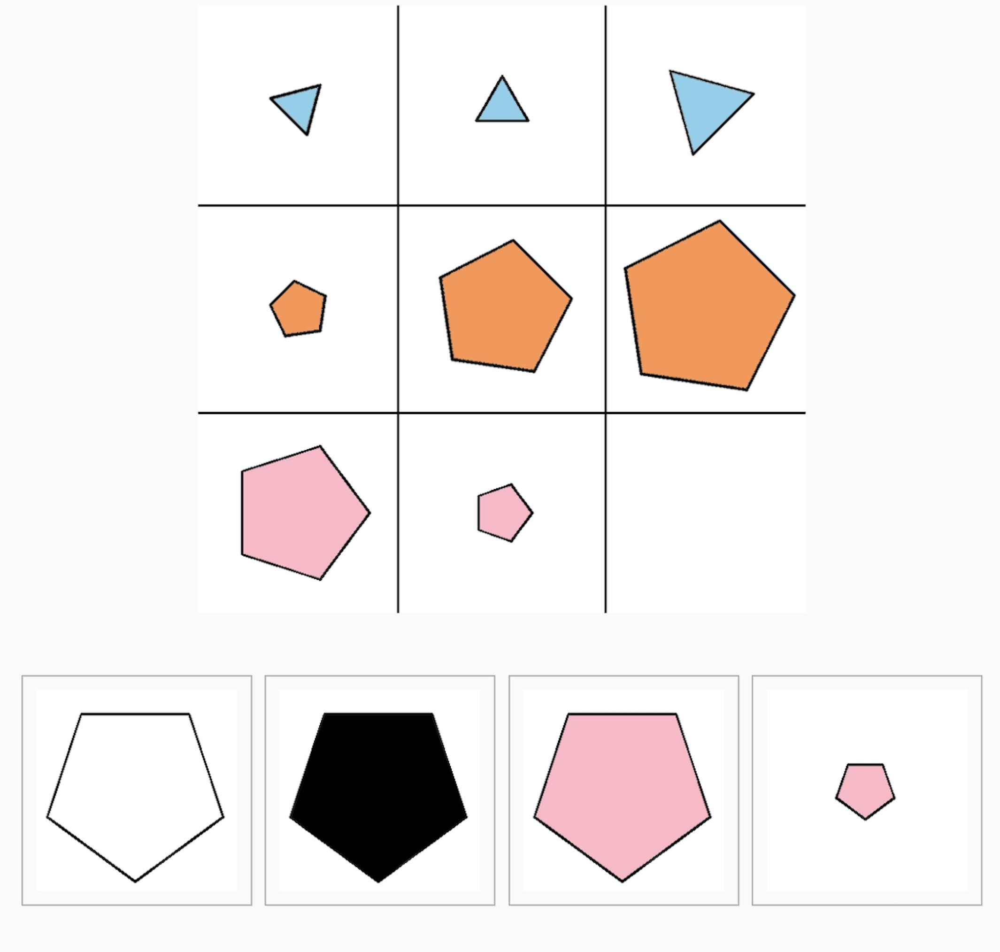

<center>
## Gedragsstudie
</center>
```{r setup, include=FALSE}
knitr::opts_chunk$set(echo = TRUE)
```


In het CODEC project testen we één week in het jaar, 3 jaar lang, de cognitieve 
vaardigheden van kinderen op de basisschool door middel van leuke tablet games.

Wij komen in een “meetweek” met ons onderzoeksteam langs in de klas. De 
kinderen zullen dan op tablets die het onderzoeksteam meeneemt naar de klas voor 
1 week, 3 keer per dag voor 15 minuten games spelen. In de klas krijgen de kinderen van ons een tablet te leen waarop een speciale app staat die wij hebben gemaakt. Een keer per jaar vragen we de kinderen in de klas om de app een week lang <b>3</b> keer op dezelfde dag een korte tijd (<b>15</b> minuten) te gebruiken.De taakjes op de app lijken erg op gewone schoolspelletjes: ze gaan over geheugen, verwerkingssnelheid en puzzels oplossen. 

Als een gift voor de participatie in de gedragsstudie hebben wij drie leuke en leerzame lespakketten gemaakt over de hersenen en de wetenschap, die wij komen geven in de klas. Klik [hier](klas.html) voor meer informatie over de gift.

[{width=30%}](meedoen.html)

<div style="left: 0; width: 100%; height: 0; position: relative; padding-bottom: 56.25%;"><iframe src="https://www.youtube.com/embed/SJ8AXydj9pU" style="top: 0; left: 0; width: 100%; height: 100%; position: absolute; border: 0;" allowfullscreen scrolling="no" allow="accelerometer; clipboard-write; encrypted-media; gyroscope; picture-in-picture; web-share;"></iframe></div>


---

<center>
## Individuele deelname (vanaf thuis)
</center>


Het is ook mogelijk om <i>individueel</i> mee te doen met de CODEC studie. In dit geval 
zullen individuele deelnemers ook 1 week lang, 3 keer per dag voor 15 minuten de 
games spelen op de tablets

De kinderen krijgen van ons een tablet te leen of gebruiken hun eigen tablet waarop een speciale app staat die wij hebben gemaakt. Een keer per jaar vragen we de kinderen om de app een week lang 3 keer op dezelfde dag een korte tijd (15 minuten) te gebruiken. Dat kan gewoon thuis. Daarnaast vragen we nog tot 2 maal per jaar om al de taakjes een keertje opnieuw te doen (25 minuten per keer).

[{width=30% align="right"}](meedoen.html)

---

<center>
## De tablet games
</center>

De games op de tablet hebben allemaal een piraten thema. De piraten leiden de kinderen door de games heen, en de kinderen kunnen met elke opdracht muntjes verdienen. In de games zitten dus leuke spelelementen, en het zijn leerzame oefeningen. Hieronder hebben we de 5 games beschreven. 

```{r, out.width = "40%", fig.align = 'center', echo=FALSE}


```

<br>

<div style="overflow: auto;">
  
  <p> <b> De mollenjacht </b> is een game waar de kinderen opzoek gaan naar schatten die de mollen in het grasveld bewaken. De kinderen moeten zo snel mogelijk op de opkomende molletjes drukken, voordat deze weer het grasveld in duiken. </p>


</div>

<br>

<div style="overflow: auto;">
  
  <p> <b> Het puzzelbos </b> is een game waar de kinderen muntjes krijgen voor het oplossen van puzzels in het puzzelbos. De kinderen moeten het goede antwoord kiezen uit 4 opties.  </p>


</div>

<br>

<div style="overflow: auto;">
  
  <p> <b> Schatzoeken </b> is een game waar de kinderen op hun scherm opzoek gaan naar de schatten. De hokjes bevatten verschillende aantal punten die de kinderen kunnen verdienen, en het is aan de kinderen om te ontdekken waar de schatten precies liggen </p>


</div>

<br>

<div style="overflow: auto;">
  
  <p> <b> Bij de stippenweg </b> is het de bedoeling dat de kinderen de stippenweg die ze net is laten zien opnieuw intoetsen op hun scherm. Ook hiermee kunnen de kinderen muntjes verdienen door de juiste stippenweg te volgen.  </p>


</div>
<br>

<div style="overflow: auto;">
  
  <p> <b> Mooie woorden </b> is een game waar de kinderen schatten kunnen verdienen bij het juist oplossen van woordenschat vragen. De kinderen zullen worden gevraagd om de tegenstelling, of de definitie van een woord.  </p>


</div>


