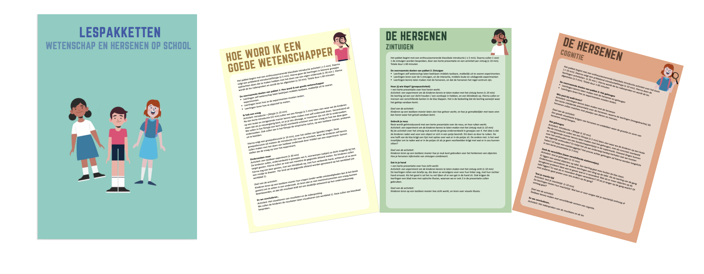

---
title: ""
description: |
favicons: ["images/favicon.ico"]
--- 

<center>
## Lespakketten
</center>
Als gift voor de participatie in het onderzoek bieden wij drie <strong> lespakketten </strong> aan die zich focussen op het opwekken van nieuwsgierigheid, het kennismaken met de hersenen en de eerste affiniteit creëren met zelf onderzoek doen. Wij willen de kinderen laten zien dat iedereen wetenschapper kan worden, en dat wetenschap hartstikke leuk is! 

De lespakketten zijn erg interactief, met mooie filmpjes die de kinderen op een leuke manier introduceren aan de lespakketten en de onderzoekers uit ons team die de lessen zullen komen geven in de klas. 

De keuze voor de pakketten is geheel vrij, er kan 1, 2 of alle drie de pakketten gekozen worden. Ook de rol die de docent speelt in het begeleiden is geheel vrije keuze. De lespakketten zijn zo opgesteld dat er voldoende instructie is om de les zelf (als docent) te leiden, maar de lessen kunnen ook gegeven worden door ons team. Wij hebben ervaring in het lesgeven in deze thema's aan kinderen op de basisschool, en zouden deze optie ook zeker aanraden! 

```{r, out.width = "60%", fig.align = 'center', echo=FALSE}

knitr::include_graphics("images/youtubefoto.png")

```

<strong> Hoe word ik een goede wetenschapper </strong> Het centrale thema uit het eerste pakket is Hoe word ik een goede wetenschapper. In dit pakket zullen de leerlingen zelf wetenschap bedrijven middels een tastbaar, makkelijk uit te voeren experiment. Ook ligt de nadruk in deze les op nieuwsgierigheid, vragen stellen, en deze met onderzoekjes kunnen beantwoorden.

<strong> De Zintuigen </strong> In pakket 2 staan de zintuigen centraal, hier leren de leerlingen over de 5 zintuigen en hun interacties , middels leuke en uitdagende experimenten. Voor alle 5 de zintuigen is een leuk en interactief experiment bedacht, met materialen die door ons onderzoeksteam naar de klas meegenomen worden. De nadruk in dit pakket ligt op het kennismaken met de zintuigen middels tastbare experimenten, waardoor de verschillende functies van de zintuigen worden uitgelicht. 

<strong> Leren over Cognitie </strong> In pakket 3 maken de kinderen nog meer kennis met de hersenen, en leren ze over hun geheugen, aandacht en cognitie, en zullen we ze kennis laten maken met onderwerpen die centraal staan in het CODEC project. Ook dit pakket zit vol met leuke en interactieve experimenten die de kinderen in de klas zullen uitvoeren. 

{width=“100%“}


