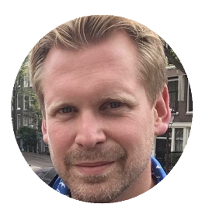
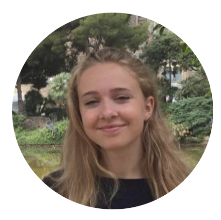

  
  
Hallo! Ik ben <b>Rogier Kievit </b> en ik ben hoogleraar ontwikkelingsneurowetenschappen aan het RadboudUMC en het Donders Instituut in Nijmegen. Ik ben nieuwsgierig naar hoe cognitieve vaardigheden zich in de kindertijd ontwikkelen, en welke rol veranderingen in het brein daarbij spelen. Ik leid het CODEC onderzoek. 

<i class="fab fa-twitter"></i>[  @rogierK](https://twitter.com/rogierK)
<i class="fas fa-envelope"></i>[  rogier.kievit@radboudumc.nl](rogier.kievit@radboudumc.nl)
<i class="ai ai-google-scholar"></i>[  Google scholar](https://scholar.google.com/citations?user=kplx7AUAAAAJ&hl=en)
<i class="ai ai-orcid"></i>[  ORCID](https://orcid.org/0000-0003-0700-4568)

---

 

  
  
 Hallo! Ik ben <b>Ilse Coolen</b>. Ik ben senior onderzoeker in ontwikkelingspsychologie aan het Donders Instituut. Ik onderzoek de ontwikkeling van cognitieve vaardigheden in kinderen en ben nieuwsgierig naar hun relatie met academische vaardigheden zoals wiskunde. 

<i class="fab fa-twitter"></i>[  @CoolenIlse](https://twitter.com/CoolenIlse)
<i class="fas fa-envelope"></i>[  ilse.coolen@radboudumc.nl](ilse.coolen@radboudumc.nl)
<i class="ai ai-google-scholar"></i>[  Google scholar](https://scholar.google.com/citations?hl=en&user=e0K_sngAAAAJ)
<i class="ai ai-orcid"></i>[  ORCID](https://orcid.org/0000-0003-2254-7851)

---

  
  
 Hoi! Mijn naam is <b>Jordy van Langen </b> en ik ben als onderzoeker (PhD student) onderdeel van het CODEC-team. Ik ben geïnteresseerd in hoe en waarom kinderen van elkaar verschillen in hun ontwikkeling.

<i class="fab fa-twitter"></i>[  @CoolenIlse](https://twitter.com/CoolenIlse)
<i class="fas fa-envelope"></i>[  jordy.vanlangen@radboudumc.nl](ilse.coolen@radboudumc.nl)
<i class="ai ai-google-scholar"></i>[  Google scholar](https://scholar.google.com/citations?hl=en&user=e0K_sngAAAAJ)
<i class="ai ai-orcid"></i>[  ORCID](https://orcid.org/0000-0003-2254-7851)

---

  
  
 Hoi! Ik ben <b>Emma Meeussen </b>. Ik ben onderzoeksassistent bij het CODEC-project en haptotherapeut. Ik ben nieuwsgierig naar de manier waarop mensen zich ontwikkelen en hoe we hen daarin het beste kunnen ondersteunen<strong> Emma </strong> is een onderzoeksassistent bij het CODEC project. 

<i class="fas fa-envelope"></i>[  emma.Meeussen@radboudumc.nl](emma.Meeussen@radboudumc.nl)

---

  
  
 Hallo! Ik ben <b>Sophie Hofman</b>. Ik ben onderzoeksassistent bij het CODEC-project. Ik ben op dit moment ook nog bezig met mijn studie gedragswetenschappen aan de Radboud Universiteit. Ik ben nieuwsgierig naar de ontwikkeling van de hersenen en van cognitieve vaardigheden.             

<i class="fas fa-envelope"></i>[  sophie.hofman@radboudumc.nl](Sophie.hofman@radboudumc.nl)

